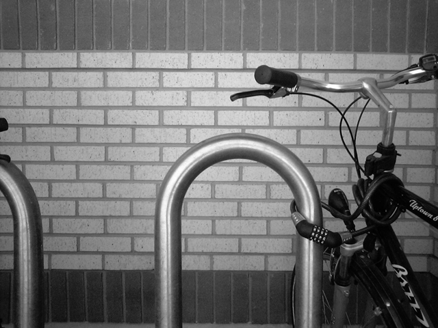
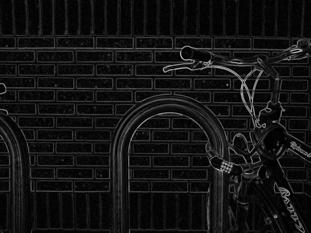
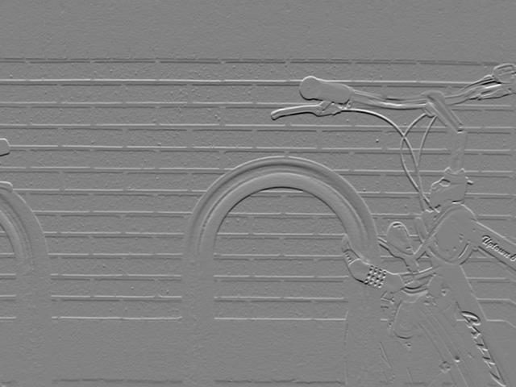
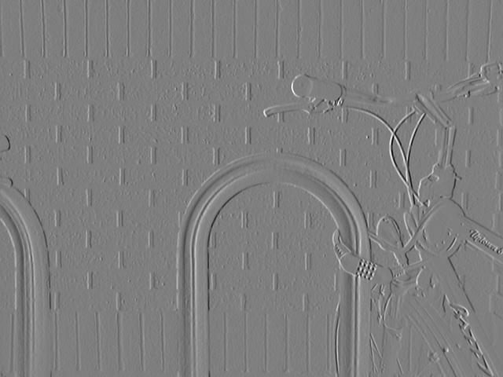
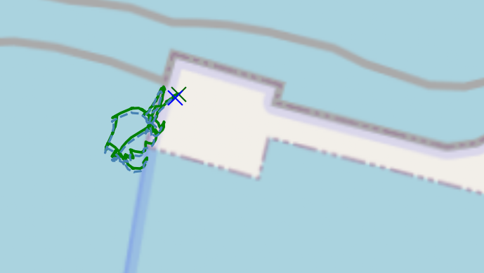

## Outline

* We have covered:

  * Representations

  * The lens camera, stereoscopy

* Moving on to:

  * Optical flow and pose estimation

  * Further relevant sensors: IMU, GPS

  * Sensor fusion

  * 3D map construction.

---

# Optical Flow

## Motion can support stereoscopy

We don't really need the two cameras, what we really needed was a
way to create a measurable disparity.

* What if we had a moving camera?

* Then in consequtive frames we can match _features_ and measure $d$

---

## Optical Flow

_Optical Flow_ is the apparent motion of brightness patterns between frames.

* _Brightness,_ not full colour, because full colour is more fragile and
  can appear different for too many reasons

* _Patterns,_ not individual points, because even 3D RGB pixels are not distinctive
  enough, and scalar brightness pixles even more so

---

## Optical Flow

Assumptions:

* High framerate: The sampling is dense enough to minimize features coming into/falling
  out of the FOV, and to have small distances for most features between frames

* Brightness constancy: A feature maintains its brightness between frames

* Rigidness: Most features move like their neighbours, as they make up a rigid body

---

## Framerate

* The smaller the movement between frames, they more stable the results

* Some features will appear or disappear, but generally few

* Any modern camera will satisfy this for any reasonable feature speed

::: {.callout-note}
### Where is the catch?

* How quickly can the on-board computer process a frame pair,
  while also navigating and performing all this various tasks?

* Low processing power approaches will be discussed tomorrow.

:::

---

## Brightness

* Constancy is easier to satisfy in brightness space than in RGB space

* Moving light sources can be a problem, but in your outdoors environment
  the sun drowns out any other light source and has no perceivable motion
  between frames

* To be trully frugal with the CPU, bear in mind that
  spatial gradients along edges matter, not the accurate
  representation of the (non-linear) human perception of brightness.
  [ITU Recommendation BT.601-7](https://www.itu.int/dms_pubrec/itu-r/rec/bt/r-rec-bt.601-7-201103-i!!pdf-e.pdf)
  has low-CPU definition that works well:
  $I = 0.299 R + 0.587 G + 0.114 R$

::: {.callout-note}
### Where is the catch?

* Sun reflecting off a _different_ moving object can suddenly change the
  brightness of your feature 

:::

---

## Rigidness

* It is the nature of feature recognition algorithms to look for corners and similar
    characteristic pixel clusters that naturally belong to the same object

* Non-rigid objects also have corners, but they are generally few.

::: {.callout-note}
### Where is the catch?

Wave foam gives features, so have that in mind if it is windy

:::

---

## Method overview

* The _Sorbel-Feldman operator_ detects edges

* The _Shi-Tomasi score_ rates corners for their stability

* Solving the _Optical Flow Equation_ finds the velocity vector (in pixels) that best explains the change

* From the velocity vector and the framerate we compute disparity $d$ and plug it into the equation we saw earlier

---

## Sorbel-Feldman Operator

* Images are discrete objects, not directly differentiable

* The Sorbel-Feldman is a computationally efficient approximation
  of the intensity gradients over 3×3 kernels, formulated
  as _integer_ matmul operations

* The result is for each pixel, the gradient in each direction

---

## Sorbel-Feldman Operator {.nostretch}

::: {style="display: grid; grid-template-columns: 1fr 1fr; grid-gap: 2px"}

::: {}
{style="width: 40%; object-fit: cover;"} 
:::

::: {}
{style="width: 40%; object-fit: cover;"} 
:::

::: {}
{style="width: 40%; object-fit: cover;"} 
:::

::: {}
{style="width: 40%; object-fit: cover;"} 
:::

:::

Attribution: [https://en.wikipedia.org/wiki/Sobel_operator](https://en.wikipedia.org/wiki/Sobel_operator)

---

## Shi-Tomasi Score

* Now we have edges, we will push on to find corners

* Corners are more stable and more efficient drivers of optical flow

  * all patches along an edge will look similar, will be near each other, and will be rigid

  * too many candidates to match, too similat to each other

* Corners are just where two edges meet, but:

  * the Sorbel-Feldman gradients are along the W-H axes, not along the edges

  * we have no reason to believe the world will be nicely aligned to the W-H axes of the image

---

## Shi-Tomasi Score

$$
\text{Structure Tensor } A = \begin{bmatrix}
\left< I_x^2 \right>  & \left< I_x I_y \right> \\ 
\left< I_x I_y \right> & \left< I_y^2 \right>   \\
\end{bmatrix}
$$

where $\left<\cdot\right>$ is the Gaussian or other aggregation over the local area.

* The Structure Tensor gives us the distribution of gradients in the area.

* If both eigenvalues are relatively large, we have a corner;
  if only one is large, we have an edge; if neither we are at a flat surface.

---

## Shi-Tomasi Score

To avoid calculating the eigenvalues, various metrics are used.

For example:

$$
M_c = 2 \frac{\det(A)}{\text{trace}(A)+0.001} = 2 \frac{\lambda_1\lambda_2}{\lambda_1+\lambda_2+0.001}
$$

will be a larger number if both $\lambda_1,\lambda_2$ are large and is a much more
efficient computation than calculating the eigenvalues just to compare them.

---

## Optical Flow Equation

_Optical flow_ is an old concept, stemming from WWII-time research on pilot vision during landing.

When used to express the _brightness constancy_ assumption, it gives us the following
mathematical formulation:

$$
\text{I}(p,t_0) - \text{I}(p+d,t_1) = 0
$$

where $p$ is a point in pixel coordinates and $d$ is the displacement in pixels
of this point between time $t_0$ and time $t_1$

Obviously we cannot solve this equation for $d$ as there will not be a unique
value for $d$ that satisfies it.

---

## Lucas-Kanade

The Lucas-Kanade methods adds the _rigidness_ assumption in the form of a region
around the pixel of interest with the same $d$.

We now have a system of equations:

$$
\begin{matrix}
\text{I}(p_0,t_0) - \text{I}(p_0+d,t_1) = 0 \\
\text{I}(p_1,t_0) - \text{I}(p_1+d,t_1) = 0 \\
\text{I}(p_2,t_0) - \text{I}(p_2+d,t_1) = 0 \\
...
\end{matrix}
$$

---

## Optimization Problem

* If we add a sufficient number of equations we will go from "too many solutions"
  to "no solution"

* This is a happy problem, becase we know how to solve it: We will use an
  optimizer to find the value of $d$ that minimizes the aggregated residue

* Our most efficient optimizers are _linear optimizers_, so if we can express
  $\text{I}(p,t)$ as a linear function we are all set

  * Currently, we have some unknown function sampled at pixel intervals

---

## Linearization

* If we take the Taylor expansion of our unknown underlying $\text{I}(p,t)$
  we will have a summation over its derivatives, where the contribution of each
  derivative to the sum gets smaller as the order increases

$$
f(x) = \sum_{n=0}^{\infty} \frac{f^{(n)}(a)}{n!} (x-a)^n
$$

* We will only keep the first derivative, so that we have a linear function

* Under our _high framerate_ assumption, this will be a good enough approximation
  
::: {.callout-note}
### Note

We are effectively imposing inertia on the motion

:::

---

## Linearization

After differentiation, our system of equations is now:

$$
\begin{matrix}
\text{I}_x(p_0) \text{d}_x + \text{I}_y(p_0) \text{d}_y + \text{I}_t(p_0) = 0 \\
\text{I}_x(p_1) \text{d}_x + \text{I}_y(p_1) \text{d}_y + \text{I}_t(p_1) = 0 \\
\text{I}_x(p_2) \text{d}_x + \text{I}_y(p_2) \text{d}_y + \text{I}_t(p_2) = 0 \\
...
\end{matrix}
$$

These are the theoretical, underlying functions that we sample when we use
a camera.

We apply Sorbet-Feldman to calculate numerical values for
the partial derivatives of $\text{I}$ at specific pixels $p_0, p_1,...$

---

## Linearization

So now we have a linear system of equations similar to

$$
\begin{matrix}
5 d_x - 13 d_y +  988 = 0 \\
2 d_x - 9 d_y + 1973 = 0 \\
2 d_x + 7 d_y + 2026 = 0 \\
...
\end{matrix}
$$

This will normally have no solution, but we can use a linear
optimizer to find the values of $d_x, d_y$ that minimize residue.

We multiply by $\Delta t$ to get the _disparity (d)_ in pixels needed to calculate
depth using $D = f_x\frac{B}{d}$

---

## On Assumptions and Optimization

* Instead of solving a 2×2 system of equations, we put together a system with
  more equations than variables, ensuring that it cannot be solved, and
  used an optimizer to find a good enough solution

* This approach gives stability in the face of the assumptions _mostly_
  (as opposed to completely) holding

* We have assumed linear, inertial, motion. If this creates _systematic_ error
  that makes _all_ equation give wrong results, we are doomed and no
  optimization trick can save us

::: {.callout-note}
### Note

Maybe the class can hypothesise about when this might happen?

:::

---

## On Computational Efficiency

* Is it worth shaving off a few nanoseconds here and there at the expense of accuracy?is worth

* The pipeline above gives the depth for _one_ pixel;
  at 1024×768 and 1 FPS gaining 10nsec per frame is 0.8\% of your CPU

* Your CPU is pretty weak, 10 nsec is conservative.
  Experiment to see the impact of each optimization.

* Your CPU has many jobs to execute. 0.8\% of the CPU is not negligible,
  and 1FPS is too sparse

* Remember our assumptions and the linearization discussion? Being able to operate
  at higher framerates can have _huge_ impact, a lot bigger than full, high-accuracy
  computations

---

# Other Sources of Pose

## Outline

* We have covered:

  * Representations

  * The lens camera, stereoscopy

  * Optical flow and pose estimation

* Moving on to:

  * Further relevant sensors: IMU, GPS

  * Sensor fusion

  * 3D map construction.

---

## Accelerometer, Gyroscope, Magnetometer

The 9-DOF IMU:

 * _Accelerometer:_ 3D acceleration

 * _Gyroscope:_ 3D angular velosity

 * _Magnetometer:_ 3D magnetic force field

Pitch, roll, and yaw and their rate of change are calculated from the 9-DOF IMU

::: {.callout-note}
### Note

Note how all three sensors measure forces, which makes sense.

:::

---

## GPS

The GPS gives geolocation

 * Can be converted to a metric space via a projection

 * Use UTM Zone 35N, although Syros almost on the fence between 34N and 35N

---

## Sensor Fusion

* GPS can have a few meters of error, but the error does not accumulate

* IMU starts out very accurate, but drifts over time

* Optical Flow accuracy can vary wildly; Optical Flow is differencial similarly to IMU,
  so its error accumulates.

* It makes sense to _fuse_ the different measurements in a way that exploits their
  respective strengths

---

## The Extended Kalman Filter (EKF)

* Any aggregation function, (weighted) mean, max, min, can be considered fusion
  but the _Kalman Filter_ excels in fusing a low-accuracy non-drifting
  measurement with a drifting measurement

* The KF is only applicable to lieanr systems, the _Extended Kalman Filter (EKF)_
  is a linearization that extends the filter's applicability to systems that
  can locally linearly approximated

---

## The Extended Kalman Filter (EKF)

_(More than 17 slides dense with maths later)_

So the key intuition is:

* The filter keeps track of a system's _state_ (here, pose) under
  uncertainty

  * as _distributions_, not as specific values

* The filter receives multiple new observations (here, pose from
  different methods) that have _independent_ error (do not err in the same
  direction)

* The filter applies statistical and control theory wizardly to:

  * behave as a stabilizer by giving 'inertia' to the previous state

  * behave as a smoothener by maintaing a _statistical_ representation
    of the values in the state vector

---

## Optical Flow/GPS vs GPS only

:::: {.columns}

::: {.column width="30%"}

Data from trials last April,

* Irregular framerate, around 1 FPS.

:::

::: {.column width="70%"}



:::

::::

---

## Optical Flow/GPS vs GPS only

{style="width: 100%; object-fit: cover;"} 

---

# Mapping

## Where is the _M_ in SLAM?

* We have so far only discussed pose estimation. Where is the map?

* In IMU/GPS localization there is no environmental observations,
  the vehicle is either geolocalized or localized wrt. its previous pose

* Optical flow has the advantage that localization is a by-product of depth
  estimation: the vehicle is localized wrt. objects in the environment

  * Not only optical flow, but all range-finding sensors (lidar, radar)

  * Optical flow is more interesting, because range information is not
    inherent to the sensor but takes some effort to extract

---

## Constructing the map

* For all range-finding localizers, the map is the point-cloud that is
  constructed by stitching together the depth images

* Using the vehicle pose to rotate/translate them to a global origin

* A fully constructed map will make subsequent localization more
  accurate

## The Map

<model-viewer 
  src="map.glb" 
  ar 
  camera-controls 
  touch-action="pan-y" 
  alt="3D Map" 
  scale="10 10 10" 
  style="width: 100%; height: 500px;">
</model-viewer>

---

