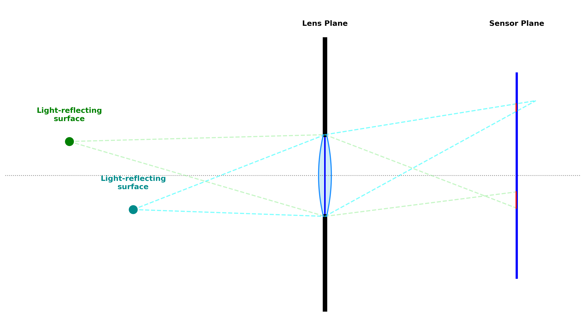
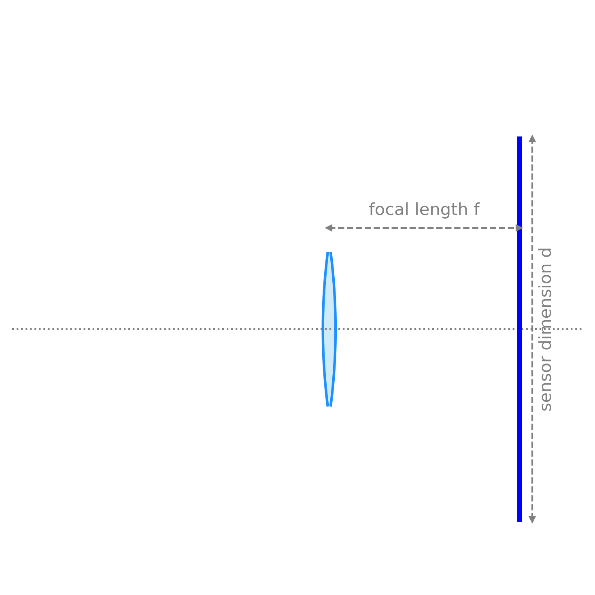
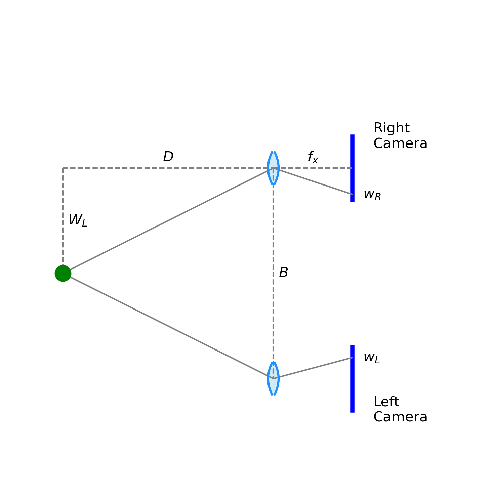

# Introduction and Outline

## What is SLAM?

_Simultaneous Localization and Mapping (SLAM)_ is the exploration of an unmapped
environment: Build a map as you go, place yourself in the half-built map.

::: {.callout-note}
### Doesn't sound too hard, what's the catch?

* Odometry drifts, so if a position is re-visited it needs to be 'snapped' onto
  the previous position to avoid distorting the map.

* For a surface vehicle, 'odometry' itself is not obvious.
:::

---

## What we will cover

* Representation: Pose, pointcloud, 2D image, depth image

* Relevant sensors and their limitations:
  Stereoscopic vs. monocular vision, IMU error and drift, GPS error.

* Conventional methods: Optical flow and pose estimation. Vision/IMU fusion.

* AI-based methods: Neural networks for pose estimation.

* 3D map construction.

---

# Representation

## SLAM: Pose, Pointcloud

Pose has 6 parameters:

* Three positional parameters, displacement from starting point

  * No prior map defining $(0,0,0)$

* Three angular parameters: _yaw_, _roll_, and _pitch_

The pointcloud is a set of $(X,Y,Z)$ triplets

* All _voxels (volumetric pixels)_ that are obstacles

::: {.callout-note}
### To SLAM is to know your pose within a pointcloud.

When localized within such a map, a robot can safely navigate
:::

## RGB Image

:::: {.columns}

::: {.column width="55%"}

* An image is the 2D projection of the real-world pointcloud.

* Depth is lost as voxels are projected to an _image plane_

* Even assuming a perfect way to recognize rigid bodies, _obstacles_,
  from water, foam, and other _navigable space_ we cannot trivially
  map pixel coordinates to metric voxel coordinates

:::

::: {.column width="5%"}

::: 

::: {.column width="40%"}

Attribution: [Pexels 29831317](https://www.pexels.com/photo/29831317)

:::

::::

---

## RGB-D Image

* An RGB image is a 3D data structure, `[x,y,c]`

* An RGB-D image, depth image, depth map, is a 4D data structure, `[x,y,D,c]`,
  where we have established the metric distance `D` between the
  light-reflecting object at pixel `[x,y]` and the camera.

## The SLAM pipeline

* A vehicle with a camera is moving around

* As the vehicle moves, the SLAM pipeline processes each frame in order to:

  - Estimate the vehicle's pose relative to the previous frame

  - Turn the 2D frame into depth image

  - Stitch the depth image to the pointcloud, the map

* In the presense of drift and uncertainty:

  - The overlapping parts will not match perfectly

  - The pose, the map, or both need small corrections

# Sensors 

## The Lens Camera

## Camera Intrinsics

:::: {.columns}

::: {.column width="55%"}

* $f$ and $d$ are physical properties of the camera

* FOV (zoom) is a property of the lens configuration, bounded by 
  $\text{FOV} \leq 2 \arctan\left(\frac{d}{2f}\right)$

:::

::: {.column width="45%"}

:::

::::

## Camera Intrinsics: Practicalities

:::: {.columns}

::: {.column width="55%"}

Estimating intrinsicis from the data is possible, but
when known we are better off using it.

Your camera is the
[Raspberry Pi Camera Module 3](https://www.raspberrypi.com/products/camera-module-3)
offering multiple configurations (resolution, standard/wide FOV)
with different intrinsics. Look up:

* Pixel size, resolution, FOV, focal length

* Computer vision application usually express $f$ in terms of pixels,
  calculating separare $f_x$ and $f_y$ values.

:::

::: {.column width="45%"}

* Your sensor has $f = 4.74 \textrm{mm}$ and a square pixel (1.4μm × 1.4μm):
  $f_x = f_y = 3386 \textrm{px}$

* If you do not use a 'native' resolution but the images are downscaled,
  pixel size changes.

* For a native resoluion 4608×2592, using 1920×1080 means
  $f_x = f_y = 1410 \textrm{px}$ since these pixels are much larger.

:::

::::

## Camera Intrinsics Matrix

In computer vision the usual representation is the matrix:

$$
K = \begin{bmatrix}
f_x & 0 & c_x \\
0 & f_y & c_y \\
0 & 0 & 1
\end{bmatrix}
$$

where $c_x, c_y$ are the coordinates of the focal centre:
Practically, $W/2, H/2$ since origin is always the bottom-left corner.

$K$ is a scale and translate transform, which makes sense as a representation
of zoom and focal centre.

## From physical coordinates to pixel coordinates

For a point $P = [W,H,D]$ within our FOV, the pixel coordinates $w,h$
will be the vector $K P$, normalized by $D$:
$$
K P = \begin{bmatrix}
f_x & 0 & c_x \\
0 & f_y & c_y \\
0 & 0 & 1
\end{bmatrix}
\begin{bmatrix}
W \\
H \\
D
\end{bmatrix}
= \begin{bmatrix}
f_x W + c_x D \\
f_y H + c_y D \\
D
\end{bmatrix}
$$

So that pixel coordinates are
$w = f_x\frac{W}{D} + c_x$ and $h = f_y\frac{H}{D} + c_y$ 

## Inverting back to physical coordinates

From the system of equations we just derived

$$
\begin{matrix}
w = f_x\frac{W}{D} + c_x \\
h = f_y\frac{H}{D} + c_y 
\end{matrix}
$$

we see algebraically what we intuited earlier: the camera
sensor loses depth information and this information cannot
be retrieved by any algebraic wizardry.

We need to go back to the physical and geometric representation
and look for some geometric wizardry.

## Stereoscopic vision

:::: {.columns}

::: {.column width="55%"}

We have lots of angular information, but not enough metric information.
We need to somehow 'ground' angular positions in the FOV to actual meters.

A stereo camera is two cameras with an _accurately_ known
baseline distance $B$.

We have a mechanism for making both cameras
focus on the same object.

:::

::: {.column width="45%"}

:::

::::

## Stereoscopic vision

:::: {.columns}

::: {.column width="55%"}

Then:

$$
\begin{matrix}
W_L/D = (w_L-c_x)/f_x \\
W_R/D = (-w_R+c_x)/f_x \\
B/D = d/f_x \\
D = f_x\frac{B}{d}
\end{matrix}
$$

::: {.callout-note}

### Almost there
So if we can measure diparity, we can calculate depth.

:::

:::

::: {.column width="45%"}

:::

::::

## Camera Extrinsics Matrix

The extrinsics matrix $[R|T]$ is the 3×4 matrix that puts together the
3×3 rotation matrix $R$ and the 3×1 translation vector $T$
that give the camera's pose with respect to an absolute world frame.

The computer vision convention for applying and naming the three rotations is:

* first apply yaw/heading angle $\psi$

* then apply pitch/elevation angle $\phi$

* lastly apply roll/bank angle $\theta$

## Camera Extrinsics Matrix

If you work out the multiplications, you will get:

$$
R = \begin{bmatrix}
\cos\psi\cos\theta &
   \cos\psi\sin\theta\sin\phi - \sin\psi\cos\phi &
   \text{c}_\psi \text{s}_\theta \text{c}_\phi + \text{s}_\psi\text{s}_\phi \\
\sin\psi\cos\theta &
   \sin\psi\sin\theta\sin\phi + \cos\psi\cos\phi &
   \text{s}_\psi\text{s}_\theta\text{c}_\phi - \text{c}_\psi\text{s}_\phi \\
-\sin\theta & \cos\theta\sin\phi & \text{c}_\theta\text{c}_\phi
\end{bmatrix}
$$

::: {.callout-note}

The right-most column uses an alternative notation that is common in the computer
vision literature; For the purpose of introducing you to this notation and for making
the equation fit the slide

:::

## Putting it all together

Then the _Fundamental Matrix_ $F$ is:

$$
F = K^{-T}[T]RK^{-1}
$$

where $[T]$ is the 3×3 _skew matrix_ built from the translation vector $T$:

$$
[T] = \begin{bmatrix}
   0 & -t_3 &  t_2 \\
 t_3 &    0 & -t_1 \\
-t_2 &  t_1 &    0 
\end{bmatrix}
$$

The fundamental matrix is the transformation that tells us how our instrinsics
and extrinsics (remember, _pose_) affect the projection of the actual world
onto our sensor.

## Putting it all together

Let us assume we have matched point $p_1$ (pixel coordinates) in one image to
point $p_2$ in
another image of the same scene. Then it _must_ be true that:

$$
p_2^T F p_1 = 0
$$

So if we can calculate $F$ from sets of matching points, then we can work backwards
to calculate our extrinsics.

## Time for a short break

We have now transformed the original SLAM problem into the computer vision
problem of recognizing the same chunk of the physical world
in two images of the same scene.

* Not single pixels, as a single pixel is not distinctive enough to recognize

* We shall call these chunks 'features'

